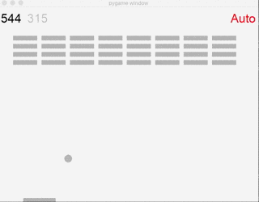

# Breakout-Q



A Q-learning Agent which plays breakout well (won't lose). [Youtube Demo](https://youtu.be/mq_lFredCx8)

The breakout game is based on [CoderDojoSV/beginner-python](https://github.com/CoderDojoSV/beginner-python)'s tutorial, and the Q-learning implementation is inspired by [SarvagyaVaish/FlappyBirdRL](http://sarvagyavaish.github.io/FlappyBirdRL/)

## About

**To start**, run:

```bash
python game.py [path of the data file]

#for example
python game.py trainedQ_breakout_perfect.npz
#or
python game.py trainedQ_breakout_perfect
#or
python game.py myTest.npz
```

The script will try to load data from the path you provided, but when file not found, it will initialize a Q array and a new data file will be created upon saving.

**To save and quit**, close the pygame window.

**To speed up**, minimize the pygame window, this will also mute the game.

## Dependency

The following python package is necessary to run the script:

- numpy
- pygame
